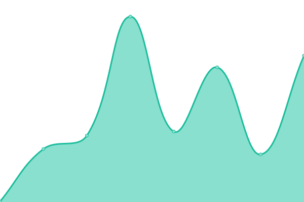
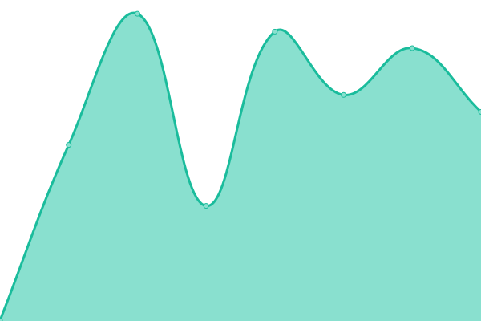
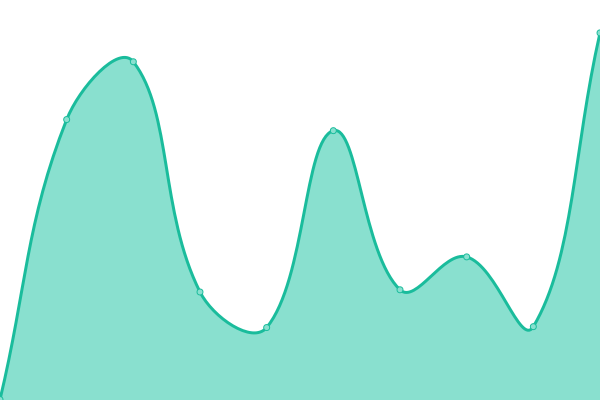

# [📈 Live Status](https://doctorfree.github.io/subdomains): <!--live status--> **🟧 Partial outage**

This repository contains the open-source uptime monitor and status page for [Ronald Record](http://ronrecord.com), powered by [Upptime](https://github.com/upptime/upptime).

With [Upptime](https://upptime.js.org), you can get your own unlimited and free uptime monitor and status page, powered entirely by a GitHub repository. We use [Issues](https://github.com/doctorfree/subdomains/issues) as incident reports, [Actions](https://github.com/doctorfree/subdomains/actions) as uptime monitors, and [Pages](https://doctorfree.github.io/subdomains) for the status page.

<!--start: status pages-->
<!-- This summary is generated by Upptime (https://github.com/upptime/upptime) -->
<!-- Do not edit this manually, your changes will be overwritten -->
<!-- prettier-ignore -->
| URL | Status | History | Response Time | Uptime |
| --- | ------ | ------- | ------------- | ------ |
|  [asciigames.neoman.dev](https://asciigames.neoman.dev) | 🟥 Down | [asciigames-neoman-dev.yml](https://github.com/doctorfree/subdomains/commits/HEAD/history/asciigames-neoman-dev.yml) | 

 0ms
     
 | 

<a href="https://doctorfree.github.io/subdomains/history/asciigames-neoman-dev">0.00%</a>
    

|  [astronvim.lazyman.dev](https://astronvim.lazyman.dev) | 🟩 Up | [astronvim-lazyman-dev.yml](https://github.com/doctorfree/subdomains/commits/HEAD/history/astronvim-lazyman-dev.yml) | 

 172ms
     
 | 

<a href="https://doctorfree.github.io/subdomains/history/astronvim-lazyman-dev">100.00%</a>
    

|  [candyvim.lazyman.dev](https://candyvim.lazyman.dev) | 🟩 Up | [candyvim-lazyman-dev.yml](https://github.com/doctorfree/subdomains/commits/HEAD/history/candyvim-lazyman-dev.yml) | 

 151ms
     
 | 

<a href="https://doctorfree.github.io/subdomains/history/candyvim-lazyman-dev">100.00%</a>
    

|  [ide.lazyman.dev](https://ide.lazyman.dev) | 🟩 Up | [ide-lazyman-dev.yml](https://github.com/doctorfree/subdomains/commits/HEAD/history/ide-lazyman-dev.yml) | 

 169ms
     
 | 

<a href="https://doctorfree.github.io/subdomains/history/ide-lazyman-dev">100.00%</a>
    

|  [lazyvim.lazyman.dev](https://lazyvim.lazyman.dev) | 🟩 Up | [lazyvim-lazyman-dev.yml](https://github.com/doctorfree/subdomains/commits/HEAD/history/lazyvim-lazyman-dev.yml) | 

 168ms
     
 | 

<a href="https://doctorfree.github.io/subdomains/history/lazyvim-lazyman-dev">100.00%</a>
    

|  [lunarvim.lazyman.dev](https://lunarvim.lazyman.dev) | 🟩 Up | [lunarvim-lazyman-dev.yml](https://github.com/doctorfree/subdomains/commits/HEAD/history/lunarvim-lazyman-dev.yml) | 

 139ms
     
 | 

<a href="https://doctorfree.github.io/subdomains/history/lunarvim-lazyman-dev">100.00%</a>
    

|  [nvchad.lazyman.dev](https://nvchad.lazyman.dev) | 🟩 Up | [nvchad-lazyman-dev.yml](https://github.com/doctorfree/subdomains/commits/HEAD/history/nvchad-lazyman-dev.yml) | 

 129ms
     
 | 

<a href="https://doctorfree.github.io/subdomains/history/nvchad-lazyman-dev">100.00%</a>
    

|  [webdev.lazyman.dev](https://webdev.lazyman.dev) | 🟩 Up | [webdev-lazyman-dev.yml](https://github.com/doctorfree/subdomains/commits/HEAD/history/webdev-lazyman-dev.yml) | 

 133ms
     
 | 

<a href="https://doctorfree.github.io/subdomains/history/webdev-lazyman-dev">100.00%</a>
    

|  [archive.ronrecord.com](https://archive.ronrecord.com) | 🟩 Up | [archive-ronrecord-com.yml](https://github.com/doctorfree/subdomains/commits/HEAD/history/archive-ronrecord-com.yml) | 

 335ms
     
 | 

<a href="https://doctorfree.github.io/subdomains/history/archive-ronrecord-com">100.00%</a>
    

|  [fractals.ronrecord.com](https://fractals.ronrecord.com) | 🟩 Up | [fractals-ronrecord-com.yml](https://github.com/doctorfree/subdomains/commits/HEAD/history/fractals-ronrecord-com.yml) | 

 258ms
     
 | 

<a href="https://doctorfree.github.io/subdomains/history/fractals-ronrecord-com">100.00%</a>
    

|  [blog.ronrecord.com](https://blog.ronrecord.com) | 🟩 Up | [blog-ronrecord-com.yml](https://github.com/doctorfree/subdomains/commits/HEAD/history/blog-ronrecord-com.yml) | 

 405ms
     
 | 

<a href="https://doctorfree.github.io/subdomains/history/blog-ronrecord-com">100.00%</a>
    

|  [themes.ronrecord.com](https://doctorfree.github.io/google-chrome-themes) | 🟩 Up | [themes-ronrecord-com.yml](https://github.com/doctorfree/subdomains/commits/HEAD/history/themes-ronrecord-com.yml) | 

 99ms
     
 | 

<a href="https://doctorfree.github.io/subdomains/history/themes-ronrecord-com">100.00%</a>
    

|  [uptime.ronrecord.com](https://uptime.ronrecord.com) | 🟩 Up | [uptime-ronrecord-com.yml](https://github.com/doctorfree/subdomains/commits/HEAD/history/uptime-ronrecord-com.yml) | 

 332ms
     
 | 

<a href="https://doctorfree.github.io/subdomains/history/uptime-ronrecord-com">100.00%</a>
    

<!--end: status pages-->

[**Visit our status website →**](https://doctorfree.github.io/subdomains)

## 📄 License

- Powered by: [Upptime](https://github.com/upptime/upptime)
- Code: [MIT](./LICENSE) © [Ronald Record](http://ronrecord.com)
- Data in the `./history` directory: [Open Database License](https://opendatacommons.org/licenses/odbl/1-0/)
